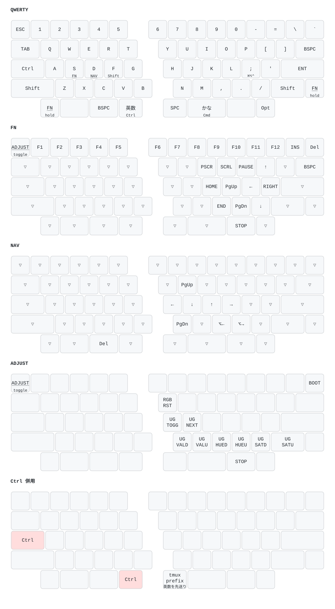

# QMK Configuration

7sPro のキーマップを [External Userspace](https://docs.qmk.fm/newbs_external_userspace) として管理する。このディレクトリが overlay_dir で、`qmk_firmware` 本体とツールチェーンはリポジトリ外に置く。

7sPro は QMK 上 **`salicylic_acid3/7skb/rev1`** (63 キー分割 / Pro Micro / ATmega32U4)。`7spro` という keyboard 定義は QMK 本家に存在しない。実機との照合は VID/PID = `0x04D8` / `0xEB5F`。

## Setup

```bash
mise run qmk   # toolchain + qmk_firmware clone + overlay_dir 登録
```

初回は数百 MB のダウンロードが走る。`mise run setup` には含めていない (7sPro を使うマシンでだけ必要なため)。

タスクが用意するもの:

| 場所 | 中身 |
|---|---|
| `~/workspaces/hagaspa/qmk_firmware` | firmware 本体 (tag 固定) |
| `~/Library/Application Support/qmk` | toolchain (avr-gcc) + flashutils (avrdude) |
| `~/.local/bin/qmk` | CLI (uv tool 経由) |
| `~/Library/Application Support/qmk/qmk.ini` | CLI 設定 (`user.qmk_home` / `user.overlay_dir`) |

## キーマップ



MacBook 内蔵キーボードでは Karabiner が近い機能を提供している (`../karabiner/HRM.md`)。整合を取るのは**ホームローの tap-hold だけ**で、最下段は 7sPro 独自 (親指の到達性を優先。2026-08-07 に方針変更)。**レイヤ方式への移行はまだ Karabiner に追随させていない** — 内蔵側は S=Opt / D=Ctrl+変換のまま。

### tap-hold 一覧

| キー | タップ | ホールド |
|---|---|---|
| S | S | `_FN` レイヤ (F1–F12) |
| D | D | `_NAV` レイヤ (矢印ほか、下記) |
| F | F | Shift (右手の文字用) |
| ; | ; | ⌘⌥⌃ (Raycast 用) |
| 左親指 内側 | 英数 | Ctrl |
| 右親指 ホーム | かな | Cmd |

修飾キーの mod-tap (S=Opt, D=Ctrl) からレイヤ方式に移行した (2026-08-07)。D=Ctrl だった頃は **`Ctrl+D` が原理的に作れず** (D 自身が Ctrl)、同手の `Ctrl+G` / `Ctrl+B` も `CHORDAL_HOLD` がタップに倒していた。Ctrl を左親指に出したことで、この制約ごと消えている。

左親指の Ctrl に 英数 が同居しているのは、**Ctrl はホールドしか使わず、英数 はタップしか使わない**ため。機能が競合しないので 1 キーに収まる。`get_hold_on_other_key_press()` に **Ctrl を入れていないのは意図的** — `PERMISSIVE_HOLD` の「相方キーを先に離したか」で判定させることで、`英数 → 左手文字` のロールが `Ctrl+D` に化けない。Cmd 側は即ホールドのままで、こちらは `Cmd+C` の体感を優先している。

`F` の Shift は右手の文字専用。`CHORDAL_HOLD` は同手のロールをタップに倒すので、**左手の文字を大文字にするときは据え置きの右 Shift を使う**。`A` には Shift を載せない (左手首腱鞘炎対策)。`J` にも載せない — vim の j/k 長押しスクロールが死ぬため (Karabiner 側は vim 系アプリで無効化しているが、QMK はホストのアプリを知らない)。

`CHORDAL_HOLD` が同手のロールをタップ扱いにするので、`fa` や `ds` のような同手ロールで誤爆しない。**ただし効くのは `TAPPING_TERM` (180ms) 以内**で、意図的に同手で使いたいときは長めにホールドしてから相方を叩く。加えて `FLOW_TAP_TERM` (150ms) が高速タイプ中のホールド判定を止める — **文字入力の直後はホールドがタップに倒れる**ので、タイプ直後の矢印や Shift は一呼吸置く。

### `A` の左 = Esc

`A` の左には `KC_ESC` を置いている (2026-08-29)。左手首外側 (尺側) の腱鞘炎対策で、**数字行左端の Esc へ手ごと動かす到達をやめるため**。

- **mod-tap にしていない。** Ctrl は左親指 (英数/Ctrl) にあるので、この位置に Ctrl を兼ねさせる理由がない。素の `KC_ESC` なので `TAPPING_TERM` の待ちも誤爆もゼロ
- 数字行左端の Esc は残置。`_FN` レイヤではそこが `TG(_ADJUST)` なので、フラッシュ手順 (下記) の押下位置は変わらない
- 内蔵キーボード側は追随していない。Karabiner で caps_lock を complex 側へ移すと `Ctrl+hjkl` → 矢印の chain が切れる懸念があるため、内蔵は `caps_lock` → `left_control` のまま

### 親指の単押しで IME

左親指 内側 = 英数 (`KC_LNG2`)、右親指 ホーム = かな (`KC_LNG1`)。Karabiner の `japanese_eisuu` / `japanese_kana` と同一の HID usage。

**Cmd は右親指の 1 箇所だけ。** `Cmd+C` / `Cmd+V` は元々右親指をアンカーにして左手の文字を打っており、左 Cmd は使っていなかった。`Cmd+K` のような右手文字との同手チョードは `chordal_hold_layout` の `'*'` で許可してある。

### NAV レイヤ (D ホールド)

| 入力 | 出力 |
|---|---|
| D + h / j / k / l | ← / ↓ / ↑ / → |
| D + , / . | Opt + ← / → (word jump) |
| D + u / n | PgUp / PgDn |
| D + 左親指 BS | Del (forward delete) |

以前は Key Overrides で `Ctrl+hjkl` → 矢印に変換していた (トリガは物理 Ctrl か D=Ctrl の HRM)。指の動きは D ホールド + hjkl のまま、経路から Ctrl を外した形。矢印はレイヤが直接発行するので、選択を伸ばすときは据え置きの右 Shift を重ねる。

`CHORDAL_HOLD` の逆手ルールと相性がよい — D は左手、対象キーはすべて右手なので同手ロールで誤爆しない。唯一の例外が左親指 BS で、これだけ chordal_hold_layout で `'*'` (除外) にして同手チョードを許可している。

Ctrl+hjkl の変換が消えたので、**素の `Ctrl+h/j/k/l` がアプリまで届くようになった** (ターミナルの Ctrl+L = clear などが復活)。nvim のウィンドウ移動 (`<C-w>hjkl` の別名) は、内蔵キーボード側の Karabiner がまだ同じ変換をしているため `.config/nvim/lua/config/keymaps.lua` では無効のまま。

### tmux prefix と IME

`Ctrl+Space` (左親指 Ctrl + 右親指 Space) は、先に 英数 (`KC_LNG2`) を送ってから `Ctrl+Space` を送る。日本語入力中でも prefix を打つだけで IME から抜けられる。左右対称の親指チョードなので小指もタイミング調整も要らない (herdr も同じ prefix)。

Karabiner 側はこれをターミナル限定にしているが、QMK はフロントのアプリを判定できないため **全アプリ対象**。`Ctrl+Space` に他の割り当てが無いので支障はない (macOS 自身の入力ソース切替は `settings.sh` で無効化済み)。

### 最下段

```
[MO(FN)][MO(FN)][   BS   ][英数/Ctrl] │ [Space][ かな/Cmd ][  死  ][ Opt ]
  1u      1.5u     1.5u     1.25u       1.25u      2u        1.5u    1u
  ✗       ✗     親指ホーム   内側        内側     親指ホーム 使わない   稀
```

**親指で常用できるのは内側 2 つずつの 4 キーだけ** (2026-08-13 に確定)。外側の 1.5u は「手をスライドすれば親指で届く」ように見えるが、実際には**左右とも薬指を畳んで押してしまう**。左手はそれで痛みが出たので、外側 2 枠は `XXXXXXX` で潰して習慣ごと断っている。低頻度キーなら置いてよい、と妥協すると同じことが起きる。

左の 1.5u だけは例外で、隣の 1u と同じ `MO(_FN)` を置いている。**打鍵するキーを増やしたのではなく、フラッシュ手順で押す先を広げただけ**。文字入力中に使うキーではないので、畳む動作の常用には繋がらない。

枠の勘定はこうなる。各キーは tap 1 + hold 1 を持てる。

- **hold は余る** — 必要なのは Ctrl (左) と Cmd (右) の 2 つだけ
- **tap が 1 つ足りない** — Space / BS / Enter / 英数 / かな の 5 つに対して 4 枠

そこで **Enter だけを親指の外に出し、右小指ホームの据え置き (2.25u) に戻した**。BS の右上より到達が近く (ホームローの横スライドだけ)、7sPro 以前に何年も使っていた位置なので覚え直しも要らない。

残りの配置原則:

- **一番外 (1u)** は親指では届かない。`MO(_FN)` (フラッシュ手順専用。左は隣の 1.5u にも同じものを置いてある) と `Opt` を置いている。**`Opt` も理屈上は畳む動作**だが、`Opt+←/→` が `_NAV` にあるため素の Opt はほぼ使わず、頻度が桁違いなので据え置いている
- **親指ホーム** (左 1.5u / 右 2u) に BS と かな/Cmd。**かな Cmd に 2u を充てているのは、最頻出ホールドのチョードアンカーだから** — Cmd+C/V のホールド中は親指の接地点がズレるので、面積がそのまま脱落防止になる
- **内側 (左 1.25u / 右 1.25u)** に 英数/Ctrl と Space。Ctrl と Space が左右対称に並ぶので、tmux prefix が親指チョードで打てる

BS は素の位置 (右上 1.5u) にも残っているので、長押しリピートが要る場面ではそちらも使える。物理 Shift (左下) は保険として残置 (`A` の左は Esc に置き換えた。下記)。

### 図の再生成

```bash
mise run qmk-keymap   # keymap.c → keymap.svg
```

[keymap-drawer](https://github.com/caksoylar/keymap-drawer) が `qmk c2json` の出力を描画する。`keymap.c` を変えたら走らせる。SVG はテキストなので diff が読める。

図は 5 レイヤーで、うち 4 つは `keymaps[][][]` から自動生成される。**5 枚目の `Ctrl 併用` だけは `keymap-notes.yaml` に手で書いている** — `Ctrl+Space` の IME 先送りは `process_record_user()` にあり、`c2json` からは見えないため。`keymap.c` のこれを変えたら手で追随させる。

`keymap-drawer.yaml` はラベルの読み替え (`KC_LNG2` → 英数 など)。`parse_config.qmk_keycode_map` に書くと組み込みの対応表ごと置き換わってしまうので、`raw_binding_map` を使っている。

## Build & Flash

```bash
qmk userspace-compile        # .hex は .config/qmk/ の直下に出る
qmk flash -kb salicylic_acid3/7skb/rev1 -km 7spro
```

`overlay_dir` は設定に入っているので、どのディレクトリからでも動く。

ATmega32U4 なので UF2 のドラッグ&ドロップではなく avrdude 書き込み。`qmk flash` はビルド後にブートローダを待つので、その間に下記の操作でブートローダへ入れる。

分割キーボードなので**左右それぞれに書き込む**。片方が終わったら USB ケーブルを反対側の Pro Micro に挿し替えて、同じ手順を繰り返す。左右の判別は基板のピン (`split.handedness.pin`) で行われるため、焼くファームは共通。

### ブートローダに入る

キーマップから入れる。物理リセットは不要。

1. `MO(_FN)` を押しながら — 最下段の左端、または最下段の 1 つ上の右端
2. **左上 Esc の位置**を押す — `_FN` レイヤーの `TG(_ADJUST)` に当たる
3. `MO(_FN)` を離す
4. **右上 Grave (`~`) の位置**を押す — `_ADJUST` レイヤーの `QK_BOOT`

`_ADJUST` はトグルなので、2 の操作でレイヤーが ON のまま維持される。USB が一度切れる音がすればブートローダに入っている (Caterina は約 8 秒でアプリに戻るので、`qmk flash` を先に走らせておくこと)。

キーマップが壊れて上記が使えない場合は、基板裏のタクトスイッチを 2 回押す。ケース越しに押せない場合は Pro Micro の RST と GND をピンセットでショートさせる ([ビルドガイド](https://salicylic-acid3.hatenablog.com/entry/7spro-build-guide))。

フラッシュは 32KB しかなく、`7skb` は `lto: true` + rgblight 有効で既に余裕がない。機能を足すときはビルド後のサイズを見る。

## 購入時ファームへの復帰

`stock/7spro-stock-2026-08-05.hex` は、QMK に焼き替える前に吸い出した購入時のファーム (VIA 対応)。**この定義は Remap のカタログ側にのみ存在し、GitHub のどこにも公開されていない**ため、これを失うと元の状態に戻せない。

```bash
avrdude -c avr109 -p m32u4 -P <port> -U flash:w:stock/7spro-stock-2026-08-05.hex:i
```

`avrdude` は `~/Library/Application Support/qmk/bin/avrdude`。`<port>` はブートローダに入った直後に現れる `/dev/cu.usbmodem*`。左右で同じファームなので 1 ファイルで足りる。

戻すと VID/PID が `0x04D8`/`0xEB5F` から `0x3265`/`0x000A` に変わり、Remap から開けるようになる。

## Pin の更新

`mise-tasks/qmk` の `QMK_FIRMWARE_REF` を上げて `mise run qmk`。

固定できるのは `qmk_firmware` のリビジョンだけで、toolchain / flashutils は `releases/latest`、Python 依存も master の `requirements.txt` を直接見に行く。ここは追随を受け入れる前提なので、**壊れたことに気づく手段はビルドを通すことだけ**。

## symlink しない

`.config/qmk/` は `link.sh` に登録していない。overlay_dir はリポジトリ内の実パスを直接指すので、symlink しても何も解決しない。

QMK CLI の設定は `~/.config/qmk/` ではなく `~/Library/Application Support/qmk/qmk.ini` (platformdirs 由来) に書かれるため、`~/.config/qmk/` は QMK からは触られない。

## Karabiner との責務分割

Complex modifications は `ifBuiltIn` で内蔵キーボードに限定してあるので、7sPro には効かない。ホームローの tap-hold と IME 切替は上記のとおり QMK 側で実装済み。

Simple Modifications (`caps_lock` → `left_control`) だけは profile 全体に効くが、このキーマップは caps lock を送らない (該当位置は `KC_ESC`) ので衝突しない。詳細は `../karabiner/README.md`。

### 移していないもの

**`J` = Shift** だけ。Karabiner 側は vim 系アプリで無効化しているが、QMK はホストのアプリを知らないため同じ切り分けができない。7sPro では右 Shift は物理キーを使う。

## VIA / Remap

使わない。`VIA_ENABLE` は有効にしていない。有効にすると EEPROM 側のキーマップが優先され、このディレクトリのソースと二重管理になる (追加機能を有効にしていないので `rules.mk` 自体が無い)。
