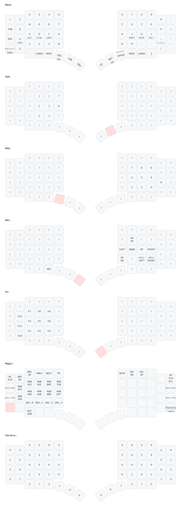

# ZMK Configuration (Go60)

[MoErgo Go60](https://www.moergo.com/pages/go60-support) のキーマップ。ファームウェアは ZMK (MoErgo のフォーク [moergo-sc/zmk](https://github.com/moergo-sc/zmk))。`config/` は公式テンプレート [moergo-keyboards/go60-zmk-config](https://github.com/moergo-keyboards/go60-zmk-config) の `config/` と同じ構成で、`go60.keymap` だけがこのリポジトリの独自物。`default.nix` / `info.json` はテンプレートから持ってきたもの (MIT)。

## 方針

**Go60 の既定レイアウトを土台にして、7sPro (`../qmk/`) から持ち込むのはホームローの tap-hold と親指クラスタだけ。** 記号・両端のキー・Keypad / Magic レイヤは既定のまま。7sPro に完全に揃えることは目的にしない (2026-09-02 に決定)。

## キーマップ



### 既定から変えた所

| 場所 | 既定 | 変更後 |
|---|---|---|
| S / D / F / `;` | 文字のみ | タップは文字のまま。ホールドで S = `FN`、D = `NAV`、F = Shift (右手の文字用。左手の文字は右 T3 の Shift で打つ)、`;` = ⌘⌥⌃ (Raycast 用) |
| 左親指 T1 (親指が休む位置) | SymbolNav レイヤ | タップで 英数 (`LANG2`)、ホールドで Ctrl |
| 右 R5 人差し指列 (Enter の真上) | Cmd | タップで かな (`LANG1`)、ホールドで Cmd |
| 左親指 T2 | Shift | Esc |
| 左親指 T3 | Ctrl | Tab (Ctrl は T1 に移ったので空いた) |
| 右親指 T3 | Opt | 右 Shift (左手の文字を大文字にする用。Opt は右 T1 の Enter ホールドに残る) |
| Space | Space | Ctrl を押さえたまま押すと 英数 を先送りしてから Ctrl+Space (`spc_ime` + `tmux_prefix`) |

SymbolNav レイヤは入口の左 T1 を使ったので削除した。Keypad (`/` の右) と Magic (`Z` の左。BT 切替・RGB・ブートローダ・Factory) は既定のまま。

### tap-hold の写し方

7sPro の QMK 設定と ZMK の対応。値は 7sPro と同じ。

| QMK (7sPro) | ZMK |
|---|---|
| `CHORDAL_HOLD` | `hold-trigger-key-positions` (右手の全キー。D だけ左 R5 の BS も含めて NAV + BS = Del を同手で許す) |
| `PERMISSIVE_HOLD` | `flavor = "balanced"` |
| `FLOW_TAP_TERM 150` | `require-prior-idle-ms = <150>` (ホームローのみ。親指には付けない) |
| `TAPPING_TERM 180` | `tapping-term-ms = <180>` |
| Cmd の `HOLD_ON_OTHER_KEY_PRESS` | `flavor = "hold-preferred"` |

キー位置番号は `keymap` の並び順そのもの: 0〜47 が上 4 行 (各行 左 6 → 右 6)、48〜50 が左 R5、51〜53 が右 R5、54〜56 が L_T1〜T3、57〜59 が R_T3〜T1。

Ctrl+Space の先送りは mod-morph。mod-morph はトリガーの Ctrl をレポートからマスクするので、マクロ側は `&kp LC(SPACE)` の implicit modifier で Ctrl を付け直す (implicit はマスクを通る。`app/src/hid.c` の `SET_MODIFIERS`)。

### NAV レイヤ (D ホールド)

| 入力 | 出力 |
|---|---|
| D + h / j / k / l | ← / ↓ / ↑ / → |
| D + , / . | Opt + ← / → |
| D + u / n | PgUp / PgDn |
| D + BS (左 R5) | Del |

### FN レイヤ (S ホールド)

数字行が F1〜F10、`-` が F11、`\` が F12。

## Build

ローカルにツールチェーンは入れない。`.config/zmk/**` を変えて push すると `.github/workflows/zmk-go60.yml` が nix でビルドし、artifact `go60.uf2` を出す。Actions の該当 run から落とす (`gh run download` でもよい)。

ファームは `moergo-sc/zmk` をタグ固定 (`ZMK_REF`、ワークフローの `env`)。上げるときはタグを書き換えて push し、ビルドが通るのを見る。公式テンプレートは `main` 追随だが、7sPro の `QMK_FIRMWARE_REF` と同じ理由で固定している。

`default.nix` の `firmware ? import ../src {}` が `src/` を `config/` の隣に期待するので、CI では `.config/zmk/src` に checkout する (`.gitignore` 済み)。

CI ができる前 (2026-09-02) は手元の Podman で同じ nix ビルドを回した。`docker.io/nixpkgs/nix` に cachix を入れて `nix-build ./config --arg firmware 'import /src/default.nix {}'`。20 分弱かかり、ストアはコンテナごと消えるので常用しない。

## Flash

同じ `go60.uf2` を**左右それぞれ**に入れる。[公式手順](https://docs.moergo.com/go60-user-guide/customizing-key-layout/)は右 → 左の順。

1. 右半分を USB-C で繋ぎ、ブートローダに入れる (下記)。赤 LED がゆっくり点滅する
2. 現れた `GO60RHBOOT` に `go60.uf2` をコピーする
3. 左半分で同じことをする。ドライブ名は `GO60LHBOOT`

### ブートローダに入る

- **キーマップから** (既定と同じ): Magic (`Z` の左) を押しながら、左は Tab、右は `\`。`&bootloader` は押したキーがある側の半分にだけ効く
- **電源投入で** (キーマップが壊れていても使える): T3 と C3R3 (左は D、右は K の位置) を押しながら電源を入れる

書き込まずに抜けるには電源を切って入れ直す。

### 業務 Mac では書き込めない

業務 Mac は Defender for Endpoint の device control が `block` で、ブートローダのドライブは認識されるがマウントされない (`mdatp health` の `device_control_enforcement_level`)。書き込みは別の端末 (別 Mac、Raspberry Pi、スマートフォンのファイルアプリ) で行う。`go60.uf2` は Slack などで運べばよい。恒常的に業務 Mac で書きたければ IT に vendor ID `0x239A` / product ID (右 `0x0029`) の許可を申請する。

## キーマップ図

```bash
mise run zmk-keymap   # go60.keymap → keymap.svg
```

`info.json` は QMK の info.json と同じ形式なので、7sPro と同じ keymap-drawer で描ける。

## Layout Editor は使わない

MoErgo の [Layout Editor](https://my.moergo.com/go60) でも同じことはできる (hold-tap / macro / mod-morph は "Custom Defined Behaviors" の欄に devicetree を書く)。使わないのは、正がクラウド側になって `.keymap` と二重管理になるため。7sPro で VIA を使わないのと同じ判断。参照用に既存のレイアウトを眺めるだけなら可。
